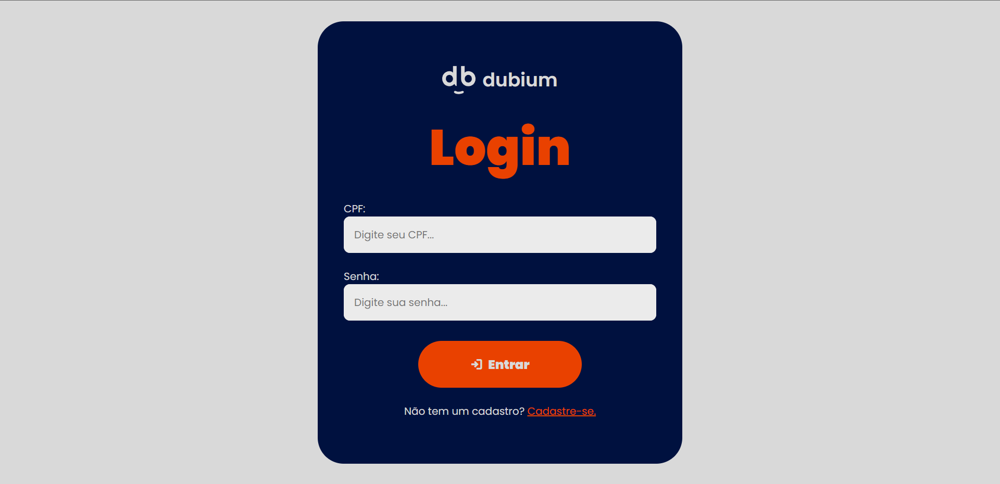
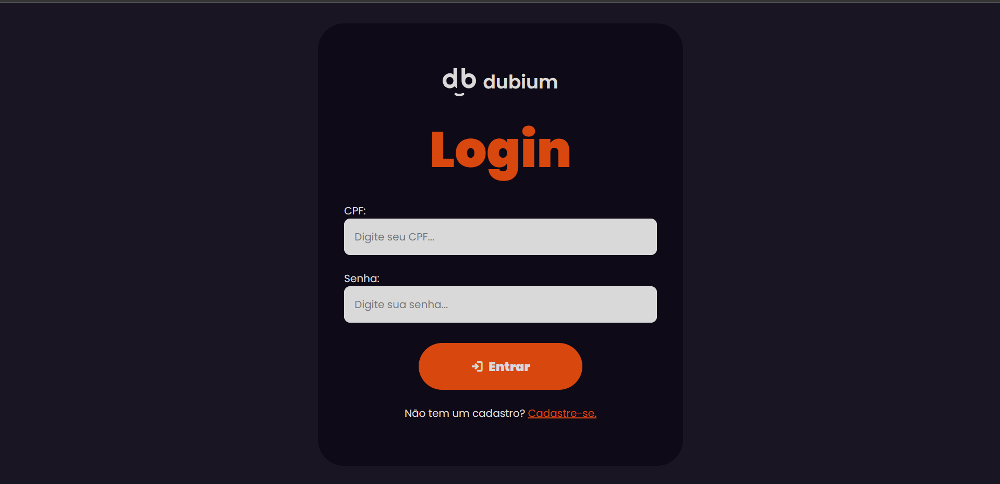
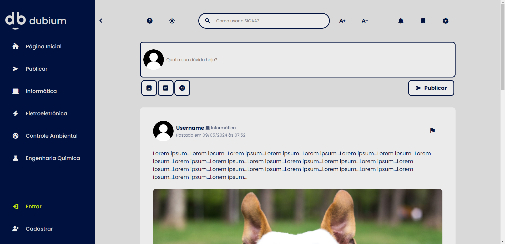
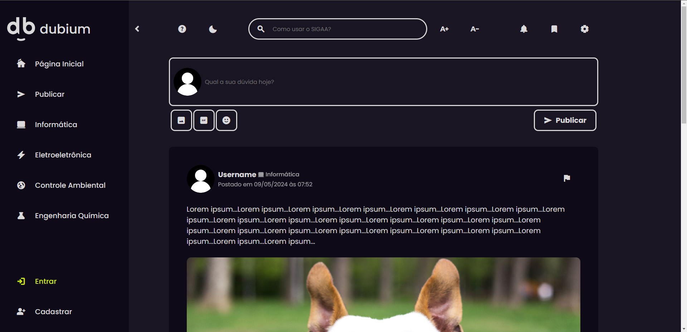
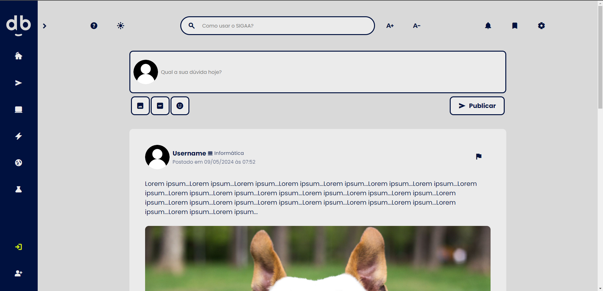
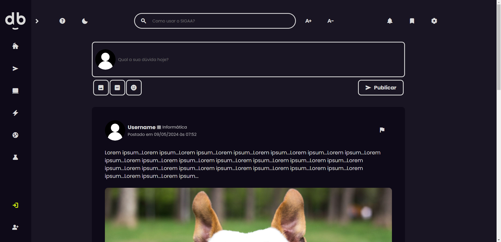

    <pre>Centro Federal de Ensino Tecnológico de Minas Gerais
    Curso Técnico Integrado de Informática</pre>
    <h1>
        
    </h1>
    
Criado por:
        <a href="https://github.com/Anna21112">Anna Luisa</a>, 
        <a href="https://github.com/Lusca1236">Lucas Vinicios</a> e 
        <a href="https://github.com/victorZoro">Victor Gabriel</a>.
         
        Alunos de INFO-3.
    

     
    
Versão: 2.0.0 (Beta - WIP)

    <h1></h1>

<h1 align="center">Proposta</h1>

O site **dubium** é um **trabalho prático** da disciplina **WEB II** com intúito de produzir um site com o tema **rede social de fóruns** focada em **dúvidas** dirigido a alunos, professores e ex-alunos, em especial, os alunos do CEFET-MG Campus Contagem.

<h1 align="center">Objetivos</h1>

- Desenvolver um website com front-end e back-end completos (sendo adicionados incrementalmente ao longo do ano letivo de 2023).

- Aprender a como construir um website seguindo as diretrizes do design de interface, pensando na acessibilidade para todos os tipos de usuário.

- Aprender a como projetar um website completo.

- Aprender a como utilizar as ferramentas HTML e CSS.

- Aprender a como utilizar as ferramentas e a linguagem de programação PHP e JavaScript.

<h1 align="center">Sobre o Projeto</h1>

- Baseado em pequenos **fóruns**.
  
- Algo similar ao site **StackOverflow**.
  
- Abordagem de **comunidades**, inspirada na antiga rede social **Orkut**.
  
- Visual inspirado em três principais sites: **StackOverflow**, **Reddit** e **Twitter**.
  
- Os softwares utilizados para a produção do site são: **Figma** (modelagem), **VSCode** (desenvolvimento).
  
- Com a abordagem de fóruns e comunidades, o lado positivo, é que não há necessidade de gastar muito tempo com criação de páginas, visto que o tempo para a entrega do trabalho é curto.

- Está sendo adicionada, na versão 2, a opção de **dark-mode**.

<h4 align="center">Ferramentas Utilizadas:</h4>

  
  
  

<h5 align="center">Nas próximas atualizações...</h5>

<h1 align="center">Modelagem</h1>

Como disto anteriormente, a modelagem do site foi feita utilizando a ferramenta de web design: Figma. A ferramenta foi escolhida por seus vários recursos facilitadores do desenvolvimento web, como criação de frames, o recurso do auto-layout, que permite criar espaços e botões com facilidade, o recurso de componentes, que permite a edição dinâmica e eficiente de elementos da tela e o recurso de inspeção, que permite visualizar o CSS do elemento selecionado.

<h4 align="center">Assets:</h4>

A página de assets possui os componentes utilizados no projeto, como os botões da barra lateral, a paleta de cores, os ícones, caixas de usuário e a logo.

<h4 align="center">Homepage:</h4>

A homepage não sofreu muitas alterações, porém, conta com algumas mudanças de visual e também a função de dark-mode.

<h4 align="center">Loginpage:</h4>

A página de login está basicamente idêntica à original, porém, com algumas poucas adaptações e a função dark-mode, que é selecionada de acordo com a escolha da página inicial.

<h1 align="center">Imagens do Site</h1>

O site segue, em 99% da sua estruturação, a modelagem feita no Figma. As ferramentas utilizadas são **HTML**, **CSS**, **JavaScript** e, futuramente, **PHP** e **MySQL**.

<h4 align="center">Página de Login:</h4>

    
    

<h4 align="center">Homepage (Sidebar Aberta):</h4>

    
    

<h4 align="center">Homepage (Sidebar Fechada):</h4>

    
    

 <pre  align="center">[Mais imagens serão adicionadas posteriormente]</pre>

<h1 align="center">Desenvolvimento</h1>

- **30/04/2023:** Foi completo o projeto da interface gráfica do site, com algumas páginas em funcionamento, exceto pelo back-end, que ainda não foi projetado por não ser o intuito atual da prática. O site ainda precisa de muitas melhorias e foi a primeira experiência real do grupo com o desenvolvimento de uma interface de site que tivesse funcionalidades mais modernas.

- **13/05/2023:** Após ser proposta a segunda parte do trabalho envolvendo o site, a reprojeção da interface gráfica e os estudos para que os problemas encontrados na versão 1.0 sejam resolvidos retornam. O site está sendo projetado no Figma, primeiramnete, para depois ser trazido ao HTML e o CSS. São esperadas mudanças significativas no design e, se possível, a projeção de um modo escuro ou modo noturno para usuários que tenham fotossensibilidade ou que estejam utilizando o site durante a noite.

- **18/05/2023:** A página de Login começa a ser desenvolvida e é terminada no mesmo dia. As imagens da página de login no seu modo claro e modo escuro serão adicionadas posteriormente à versão completa da página inicial, quando for finalizada.

- **20/05/2023:** A página inicial começa a ser desenvolvida. A expectativa é que a página inicial seja finalizazda até o dia seguinte (21/05), porém, imprevistos podem acontecer durante o desenvolvimento, atrasando a página.

- **31/05/2023:** Devido a inúmeros atrasos durante os dias da semana e problemas pessoais, a página principal acaba de ser finalizada no dia de hoje. Apesar de tudo, tudo que foi adicionado funciona de acordo com o esperado.

<h1 align="center">Conclusão</h1>

<pre  align="center">[Será escrita ao fim do projeto.]</pre>

<h1 align="center">Considerações</h1>

- Não nos responsabilizamos por qualquer plágio de qualquer aluno de nosso Campus, instituição ou de quaisquer outras instituições. O repositório é aberto para consultas de outrém, porém nenhum plágio do trabalho realizado aqui é incentivado.
  
- Todas as fontes utilizadas estão disponíveis para uso pessoal e comercial gratuitamente e estão disponibilzadas nos sites referênciados abaixo.
  
- Todas as imagens e ícones de terceiros serão creditadas abaixo.

<h1 align="center">Materiais Utilizados</h1>

1. **Ícones:** <a href="https://fonts.google.com/icons">Material Symbols</a>. 
2. **Fontes:** <a href="https://fonts.google.com/specimen/Poppins?query=Poppins&preview.text=Poppins&preview.text_type=custom">Poppins</a> e <a href="https://fonts.google.com/specimen/Roboto?query=roboto&preview.text=Poppins&preview.text_type=custom">Roboto</a>.

